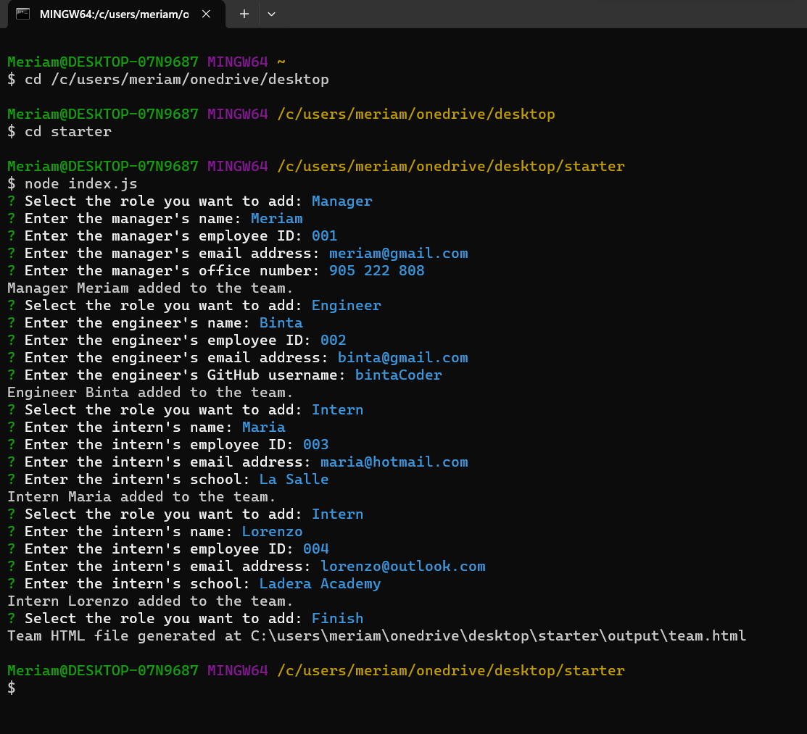
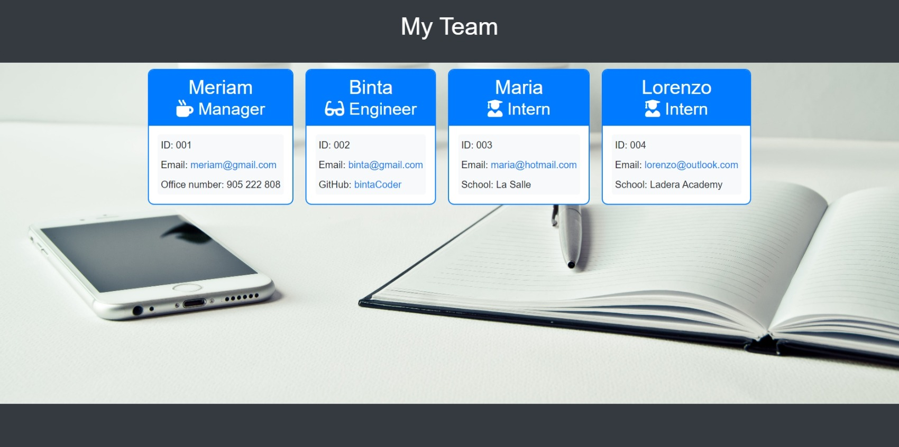

# Build-A-Team 👥

## Description

This project is a command-line application designed to generate HTML files for a software engineering team based on user input. The application focuses on creating a team profile with information about team members.

- [Installation](#installation)
- [Instructions](#instructions)
- [Resources](#resources)
- [License](#license)

  
## Installation

Before running the application, make sure you have Node.js installed on your machine. You can download Node.js from [here](https://nodejs.org/).

1. Clone this repository to your local machine.
2. Open a terminal and navigate to the project directory.
3. Run the command `npm install` to install the required dependencies.
4. Invoke the application using `node index.js`.

## Instructions

To use the Build-A-Team application, follow these steps:

1. Open a terminal and navigate to the project directory.
2. Run the command `node index.js` to start the application.
3. Follow the prompts to input information about team members:
    - Start by entering details for the team manager.
    - Add engineers or interns as needed.
    - Choose to finish building the team when all members are added.
4. Once the team is complete, the application will generate an HTML file named "team.html" in the output folder.
5. Open the generated HTML file in a web browser to view the team profile.

Feel free to customize the generated HTML file further to meet your styling preferences.

Sample of generated website application: 

**Note:** The team members and information added in the original application are purely fictional and for demonstration purposes only. The HTML file can be used independently, customized, or used as a template according to your specific needs.

## Resources

- [MDN Web Docs](https://developer.mozilla.org/): An invaluable resource for JavaScript documentation and examples.
- [Stack Overflow](https://stackoverflow.com/): A helpful community for problem-solving and debugging.
- [W3Schools](https://www.w3schools.com/): A comprehensive source for learning and practicing web development concepts.
- [GitHub](https://github.com/): For version control and project hosting.
- [Codecademy](https://www.codecademy.com/): For providing interactive learning experiences.
- [edX](https://www.edx.org/): For providing a learning platform.

## License

This project is licensed under the [MIT License](LICENSE).
